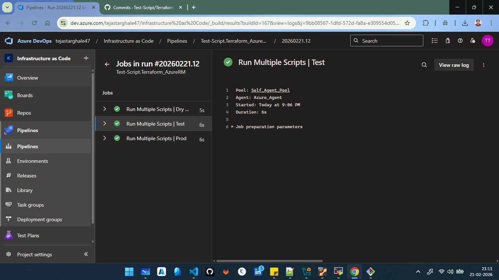

=================================================================================================================
                                       Pipeline Structure
=================================================================================================================

trigger:
- main

pool:
  name: Self_Agent_Pool

jobs:
- job: DryScript
  displayName: 'Run Multiple Scripts | Dry Run'
  steps:
    - script: echo "Hello, World!"
      displayName: 'Run a one-line script | Dry Run'
    - script: |
        echo "This is a multi-line script."
        echo "You can run multiple commands here."
      displayName: 'Run a multi-line script | Dry Run'
    - script: |
        echo "This is a script with a custom display name."
      displayName: 'Run a multi-line script with a custom name | Dry Run'
- job: TestScripts
  displayName: 'Run Multiple Scripts | Test'
  dependsOn: DryScript
  steps:
    - script: echo "Hello, World!"
      displayName: 'Run a one-line script | Test'
    - script: |
        echo "This is a multi-line script."
        echo "You can run multiple commands here."
      displayName: 'Run a multi-line script | Test'
    - script: |
        echo "This is a script with a custom display name."
      displayName: 'Run a multi-line script with a custom name | Test'
- job: ProdScripts
  displayName: 'Run Multiple Scripts | Prod'
  dependsOn: TestScripts
  steps:
    - script: echo "Hello, World!"
      displayName: 'Run a one-line script | Prod'
    - script: |
        echo "This is a multi-line script."
        echo "You can run multiple commands here."
      displayName: 'Run a multi-line script | Prod'
    - script: |
        echo "This is a script with a custom display name."
      displayName: 'Run a multi-line script with a custom name | Prod'

=================================================================================================================
                                        Initialize job | Dry Run
=================================================================================================================

Starting: Initialize job
Agent name: 'Azure_Agent'
Agent machine name: 'admin'
Current agent version: '4.266.2'
Agent running as: 'vboxuser'
Prepare build directory.
Set build variables.
Download all required tasks.
Checking job knob settings.
   Knob: DockerActionRetries = true Source: $(VSTSAGENT_DOCKER_ACTION_RETRIES) 
   Knob: UseGitLongPaths = true Source: $(USE_GIT_LONG_PATHS) 
   Knob: UseNode24withHandlerData = True Source: $(DistributedTask.Agent.UseNode24withHandlerData) 
   Knob: EnableIssueSourceValidation = true Source: $(ENABLE_ISSUE_SOURCE_VALIDATION) 
   Knob: AgentEnablePipelineArtifactLargeChunkSize = true Source: $(AGENT_ENABLE_PIPELINEARTIFACT_LARGE_CHUNK_SIZE) 
   Knob: ContinueAfterCancelProcessTreeKillAttempt = true Source: $(VSTSAGENT_CONTINUE_AFTER_CANCEL_PROCESSTREEKILL_ATTEMPT) 
   Knob: ProcessHandlerSecureArguments = false Source: $(AZP_75787_ENABLE_NEW_LOGIC) 
   Knob: ProcessHandlerSecureArguments = false Source: $(AZP_75787_ENABLE_NEW_LOGIC_LOG) 
   Knob: ProcessHandlerTelemetry = true Source: $(AZP_75787_ENABLE_COLLECT) 
   Knob: UseNewNodeHandlerTelemetry = True Source: $(DistributedTask.Agent.USENEWNODEHANDLERTELEMETRY) 
   Knob: ProcessHandlerEnableNewLogic = true Source: $(AZP_75787_ENABLE_NEW_PH_LOGIC) 
   Knob: EnableResourceMonitorDebugOutput = true Source: $(AZP_ENABLE_RESOURCE_MONITOR_DEBUG_OUTPUT) 
   Knob: EnableResourceUtilizationWarnings = true Source: $(AZP_ENABLE_RESOURCE_UTILIZATION_WARNINGS) 
   Knob: IgnoreVSTSTaskLib = true Source: $(AZP_AGENT_IGNORE_VSTSTASKLIB) 
   Knob: FailJobWhenAgentDies = true Source: $(FAIL_JOB_WHEN_AGENT_DIES) 
   Knob: CheckForTaskDeprecation = true Source: $(AZP_AGENT_CHECK_FOR_TASK_DEPRECATION) 
   Knob: CheckIfTaskNodeRunnerIsDeprecated246 = True Source: $(DistributedTask.Agent.CheckIfTaskNodeRunnerIsDeprecated246) 

=================================================================================================================
                                Checkout Test-Script/Terraform_AzureRM@main to s
=================================================================================================================

Starting: Checkout Test-Script/Terraform_AzureRM@main to s
==============================================================================
Task         : Get sources
Description  : Get sources from a repository. Supports Git, TfsVC, and SVN repositories.
Version      : 1.0.0
Author       : Microsoft
Help         : [More Information](https://go.microsoft.com/fwlink/?LinkId=798199)
==============================================================================
Syncing repository: Test-Script/Terraform_AzureRM (GitHub)
git version
git version 2.43.0
git config --get remote.origin.url
git clean -ffdx
git reset --hard HEAD
HEAD is now at a0e7294 Dry Run
git sparse-checkout disable
git config gc.auto 0
git config core.longpaths true
git config --get-all http.https://github.com/Test-Script/Terraform_AzureRM.extraheader
git config --get-all http.extraheader
git config --get-regexp .*extraheader
git config --get-all http.proxy
git config http.version HTTP/1.1
git config --get-all remote.origin.promisor
git config --get-all remote.origin.partialclonefilter
git --config-env=http.extraheader=env_var_http.extraheader fetch --force --tags --prune --prune-tags --progress --no-recurse-submodules origin --depth=1  +7512e2d34c7ce4f83411d8caf97d88f70bdcc57e:refs/remotes/origin/7512e2d34c7ce4f83411d8caf97d88f70bdcc57e

=================================================================================================================
                                        Run a one-line script | Dry Run
=================================================================================================================

Starting: Run a one-line script | Dry Run
==============================================================================
Task         : Command line
Description  : Run a command line script using Bash on Linux and macOS and cmd.exe on Windows
Version      : 2.268.0
Author       : Microsoft Corporation
Help         : https://docs.microsoft.com/azure/devops/pipelines/tasks/utility/command-line
==============================================================================
Generating script.
Script contents:
echo "Hello, World!"
========================== Starting Command Output ===========================
/usr/bin/bash --noprofile --norc /home/vboxuser/Agent/_work/_temp/dbf1f757-d0dd-47be-9d62-6d2d61402f06.sh
Hello, World!

Finishing: Run a one-line script | Dry Run

=================================================================================================================
                                    Run a multi-line script | Dry Run
=================================================================================================================

Starting: Run a multi-line script | Dry Run
==============================================================================
Task         : Command line
Description  : Run a command line script using Bash on Linux and macOS and cmd.exe on Windows
Version      : 2.268.0
Author       : Microsoft Corporation
Help         : https://docs.microsoft.com/azure/devops/pipelines/tasks/utility/command-line
==============================================================================
Generating script.
========================== Starting Command Output ===========================
/usr/bin/bash --noprofile --norc /home/vboxuser/Agent/_work/_temp/f9784ec9-f233-4e4d-8fdf-f996bfa0c305.sh
This is a multi-line script.
You can run multiple commands here.

Finishing: Run a multi-line script | Dry Run

=================================================================================================================
                                Run a multi-line script with a custom name | Dry Run
=================================================================================================================

Starting: Run a multi-line script with a custom name | Dry Run
==============================================================================
Task         : Command line
Description  : Run a command line script using Bash on Linux and macOS and cmd.exe on Windows
Version      : 2.268.0
Author       : Microsoft Corporation
Help         : https://docs.microsoft.com/azure/devops/pipelines/tasks/utility/command-line
==============================================================================
Generating script.
Script contents:
echo "This is a script with a custom display name."
========================== Starting Command Output ===========================
/usr/bin/bash --noprofile --norc /home/vboxuser/Agent/_work/_temp/59ef4fea-6083-489a-afe2-7aee0990151a.sh
This is a script with a custom display name.

Finishing: Run a multi-line script with a custom name | Dry Run

=================================================================================================================
                                Post-job: Checkout Test-Script/Terraform_AzureRM@main to s
=================================================================================================================

Starting: Checkout Test-Script/Terraform_AzureRM@main to s
==============================================================================
Task         : Get sources
Description  : Get sources from a repository. Supports Git, TfsVC, and SVN repositories.
Version      : 1.0.0
Author       : Microsoft
Help         : [More Information](https://go.microsoft.com/fwlink/?LinkId=798199)
==============================================================================
Cleaning any cached credential from repository: Test-Script/Terraform_AzureRM (GitHub)
Finishing: Checkout Test-Script/Terraform_AzureRM@main to s

=================================================================================================================
                                                Finalize Job
=================================================================================================================

Starting: Finalize Job
Cleaning up task key
Start cleaning up orphan processes.
Finishing: Finalize Job

=================================================================================================================
                                        Initialize job | Test Run
=================================================================================================================

Starting: Initialize job
Agent name: 'Azure_Agent'
Agent machine name: 'admin'
Current agent version: '4.266.2'
Agent running as: 'vboxuser'
Prepare build directory.
Set build variables.
Download all required tasks.
Checking job knob settings.
   Knob: DockerActionRetries = true Source: $(VSTSAGENT_DOCKER_ACTION_RETRIES) 
   Knob: UseGitLongPaths = true Source: $(USE_GIT_LONG_PATHS) 
   Knob: UseNode24withHandlerData = True Source: $(DistributedTask.Agent.UseNode24withHandlerData) 
   Knob: EnableIssueSourceValidation = true Source: $(ENABLE_ISSUE_SOURCE_VALIDATION) 
   Knob: AgentEnablePipelineArtifactLargeChunkSize = true Source: $(AGENT_ENABLE_PIPELINEARTIFACT_LARGE_CHUNK_SIZE) 
   Knob: ContinueAfterCancelProcessTreeKillAttempt = true Source: $(VSTSAGENT_CONTINUE_AFTER_CANCEL_PROCESSTREEKILL_ATTEMPT) 
   Knob: ProcessHandlerSecureArguments = false Source: $(AZP_75787_ENABLE_NEW_LOGIC) 
   Knob: ProcessHandlerSecureArguments = false Source: $(AZP_75787_ENABLE_NEW_LOGIC_LOG) 
   Knob: ProcessHandlerTelemetry = true Source: $(AZP_75787_ENABLE_COLLECT) 
   Knob: UseNewNodeHandlerTelemetry = True Source: $(DistributedTask.Agent.USENEWNODEHANDLERTELEMETRY) 
   Knob: ProcessHandlerEnableNewLogic = true Source: $(AZP_75787_ENABLE_NEW_PH_LOGIC) 
   Knob: EnableResourceMonitorDebugOutput = true Source: $(AZP_ENABLE_RESOURCE_MONITOR_DEBUG_OUTPUT) 
   Knob: EnableResourceUtilizationWarnings = true Source: $(AZP_ENABLE_RESOURCE_UTILIZATION_WARNINGS) 
   Knob: IgnoreVSTSTaskLib = true Source: $(AZP_AGENT_IGNORE_VSTSTASKLIB) 
   Knob: FailJobWhenAgentDies = true Source: $(FAIL_JOB_WHEN_AGENT_DIES) 
   Knob: CheckForTaskDeprecation = true Source: $(AZP_AGENT_CHECK_FOR_TASK_DEPRECATION) 
   Knob: CheckIfTaskNodeRunnerIsDeprecated246 = True Source: $(DistributedTask.Agent.CheckIfTaskNodeRunnerIsDeprecated246) 

=================================================================================================================
                              Checkout Test-Script/Terraform_AzureRM@main to s
=================================================================================================================

Starting: Checkout Test-Script/Terraform_AzureRM@main to s
==============================================================================
Task         : Get sources
Description  : Get sources from a repository. Supports Git, TfsVC, and SVN repositories.
Version      : 1.0.0
Author       : Microsoft
Help         : [More Information](https://go.microsoft.com/fwlink/?LinkId=798199)
==============================================================================
Syncing repository: Test-Script/Terraform_AzureRM (GitHub)
git version
git version 2.43.0
git config --get remote.origin.url
git clean -ffdx
git reset --hard HEAD
HEAD is now at 7512e2d Dry Run
git sparse-checkout disable
git config gc.auto 0
git config core.longpaths true
git config --get-all http.https://github.com/Test-Script/Terraform_AzureRM.extraheader
git config --get-all http.extraheader
git config --get-regexp .*extraheader
git config --get-all http.proxy
git config http.version HTTP/1.1
git config --get-all remote.origin.promisor
git config --get-all remote.origin.partialclonefilter
git --config-env=http.extraheader=env_var_http.extraheader fetch --force --tags --prune --prune-tags --progress --no-recurse-submodules origin --depth=1  +7512e2d34c7ce4f83411d8caf97d88f70bdcc57e:refs/remotes/origin/7512e2d34c7ce4f83411d8caf97d88f70bdcc57e

=================================================================================================================
                                          Run a one-line script | Test
=================================================================================================================

Starting: Run a one-line script | Test
==============================================================================
Task         : Command line
Description  : Run a command line script using Bash on Linux and macOS and cmd.exe on Windows
Version      : 2.268.0
Author       : Microsoft Corporation
Help         : https://docs.microsoft.com/azure/devops/pipelines/tasks/utility/command-line
==============================================================================
Generating script.
Script contents:
echo "Hello, World!"
========================== Starting Command Output ===========================
/usr/bin/bash --noprofile --norc /home/vboxuser/Agent/_work/_temp/79ea9965-b9c1-4cb6-b236-bedb925fc0ac.sh
Hello, World!

Finishing: Run a one-line script | Test

=================================================================================================================
                                       Run a multi-line script | Test
=================================================================================================================

Starting: Run a multi-line script | Test
==============================================================================
Task         : Command line
Description  : Run a command line script using Bash on Linux and macOS and cmd.exe on Windows
Version      : 2.268.0
Author       : Microsoft Corporation
Help         : https://docs.microsoft.com/azure/devops/pipelines/tasks/utility/command-line
==============================================================================
Generating script.
========================== Starting Command Output ===========================
/usr/bin/bash --noprofile --norc /home/vboxuser/Agent/_work/_temp/fc779370-72e2-455a-b583-5361a301eea2.sh
This is a multi-line script.
You can run multiple commands here.

Finishing: Run a multi-line script | Test

=================================================================================================================
                              Run a multi-line script with a custom name | Test
=================================================================================================================

Starting: Run a multi-line script with a custom name | Test
==============================================================================
Task         : Command line
Description  : Run a command line script using Bash on Linux and macOS and cmd.exe on Windows
Version      : 2.268.0
Author       : Microsoft Corporation
Help         : https://docs.microsoft.com/azure/devops/pipelines/tasks/utility/command-line
==============================================================================
Generating script.
Script contents:
echo "This is a script with a custom display name."
========================== Starting Command Output ===========================
/usr/bin/bash --noprofile --norc /home/vboxuser/Agent/_work/_temp/b7443c8d-8ff3-41f6-bad5-7d8d85d424b6.sh
This is a script with a custom display name.

Finishing: Run a multi-line script with a custom name | Test

=================================================================================================================
                        Post-job: Checkout Test-Script/Terraform_AzureRM@main to s
=================================================================================================================

Starting: Checkout Test-Script/Terraform_AzureRM@main to s
==============================================================================
Task         : Get sources
Description  : Get sources from a repository. Supports Git, TfsVC, and SVN repositories.
Version      : 1.0.0
Author       : Microsoft
Help         : [More Information](https://go.microsoft.com/fwlink/?LinkId=798199)
==============================================================================
Cleaning any cached credential from repository: Test-Script/Terraform_AzureRM (GitHub)
Finishing: Checkout Test-Script/Terraform_AzureRM@main to s

=================================================================================================================
                                                Finalize Job
=================================================================================================================

Starting: Finalize Job
Cleaning up task key
Start cleaning up orphan processes.
Finishing: Finalize Job

=================================================================================================================

