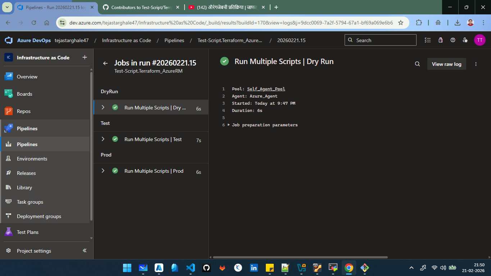

=======================================================================================
                            #20260221.15 • Dry Run | With stages
=======================================================================================

2026-02-21T16:17:35.4562666Z ##[section]Starting: Run Multiple Scripts | Dry Run
2026-02-21T16:17:35.7751933Z ##[section]Starting: Initialize job
2026-02-21T16:17:35.7756045Z Agent name: 'Azure_Agent'
2026-02-21T16:17:35.7756628Z Agent machine name: 'admin'
2026-02-21T16:17:35.7756897Z Current agent version: '4.266.2'
2026-02-21T16:17:35.9315082Z Agent running as: 'vboxuser'
2026-02-21T16:17:35.9385056Z Prepare build directory.
2026-02-21T16:17:36.0585599Z Set build variables.
2026-02-21T16:17:36.0629858Z Download all required tasks.
2026-02-21T16:17:36.1922162Z Checking job knob settings.
2026-02-21T16:17:36.1927425Z    Knob: DockerActionRetries = true Source: $(VSTSAGENT_DOCKER_ACTION_RETRIES) 
2026-02-21T16:17:36.2001390Z    Knob: UseGitLongPaths = true Source: $(USE_GIT_LONG_PATHS) 
2026-02-21T16:17:36.2007628Z    Knob: UseNode24withHandlerData = True Source: $(DistributedTask.Agent.UseNode24withHandlerData) 
2026-02-21T16:17:36.2013748Z    Knob: EnableIssueSourceValidation = true Source: $(ENABLE_ISSUE_SOURCE_VALIDATION) 
2026-02-21T16:17:36.2015250Z    Knob: AgentEnablePipelineArtifactLargeChunkSize = true Source: $(AGENT_ENABLE_PIPELINEARTIFACT_LARGE_CHUNK_SIZE) 
2026-02-21T16:17:36.2018107Z    Knob: ContinueAfterCancelProcessTreeKillAttempt = true Source: $(VSTSAGENT_CONTINUE_AFTER_CANCEL_PROCESSTREEKILL_ATTEMPT) 
2026-02-21T16:17:36.2018974Z    Knob: ProcessHandlerSecureArguments = false Source: $(AZP_75787_ENABLE_NEW_LOGIC) 
2026-02-21T16:17:36.2019555Z    Knob: ProcessHandlerSecureArguments = false Source: $(AZP_75787_ENABLE_NEW_LOGIC_LOG) 
2026-02-21T16:17:36.2030321Z    Knob: ProcessHandlerTelemetry = true Source: $(AZP_75787_ENABLE_COLLECT) 
2026-02-21T16:17:36.2031681Z    Knob: UseNewNodeHandlerTelemetry = True Source: $(DistributedTask.Agent.USENEWNODEHANDLERTELEMETRY) 
2026-02-21T16:17:36.2032854Z    Knob: ProcessHandlerEnableNewLogic = true Source: $(AZP_75787_ENABLE_NEW_PH_LOGIC) 
2026-02-21T16:17:36.2035211Z    Knob: EnableResourceMonitorDebugOutput = true Source: $(AZP_ENABLE_RESOURCE_MONITOR_DEBUG_OUTPUT) 
2026-02-21T16:17:36.2036447Z    Knob: EnableResourceUtilizationWarnings = true Source: $(AZP_ENABLE_RESOURCE_UTILIZATION_WARNINGS) 
2026-02-21T16:17:36.2037555Z    Knob: IgnoreVSTSTaskLib = true Source: $(AZP_AGENT_IGNORE_VSTSTASKLIB) 
2026-02-21T16:17:36.2038096Z    Knob: FailJobWhenAgentDies = true Source: $(FAIL_JOB_WHEN_AGENT_DIES) 
2026-02-21T16:17:36.2045777Z    Knob: CheckForTaskDeprecation = true Source: $(AZP_AGENT_CHECK_FOR_TASK_DEPRECATION) 
2026-02-21T16:17:36.2055510Z    Knob: CheckIfTaskNodeRunnerIsDeprecated246 = True Source: $(DistributedTask.Agent.CheckIfTaskNodeRunnerIsDeprecated246) 
2026-02-21T16:17:36.2066092Z    Knob: EnableTimeoutLogFlushing = True Source: $(DistributedTask.Agent.EnableTimeoutLogFlushing) 
2026-02-21T16:17:36.2072277Z    Knob: LogTaskNameInUserAgent = true Source: $(AZP_AGENT_LOG_TASKNAME_IN_USERAGENT) 
2026-02-21T16:17:36.2074965Z    Knob: UseFetchFilterInCheckoutTask = true Source: $(AGENT_USE_FETCH_FILTER_IN_CHECKOUT_TASK) 
2026-02-21T16:17:36.2083826Z    Knob: Rosetta2Warning = true Source: $(ROSETTA2_WARNING) 
2026-02-21T16:17:36.2085180Z    Knob: CheckPsModulesLocations = False Source: $(DistributedTask.Agent.CheckPsModulesLocations) 
2026-02-21T16:17:36.2087115Z    Knob: AddForceCredentialsToGitCheckoutEnhanced = True Source: $(DistributedTask.Agent.AddForceCredentialsToGitCheckoutEnhanced) 
2026-02-21T16:17:36.2088219Z    Knob: UseLatestTfExe = True Source: $(DistributedTask.Agent.UseLatestTfExe) 
2026-02-21T16:17:36.2102817Z    Knob: UseSparseCheckoutInCheckoutTask = true Source: $(AGENT_USE_SPARSE_CHECKOUT_IN_CHECKOUT_TASK) 
2026-02-21T16:17:36.2107273Z    Knob: AgentCDNConnectivityFailWarning = False Source: $(DistributedTask.Agent.AgentCDNConnectivityFailWarning) 
2026-02-21T16:17:36.2108656Z    Knob: UseEnhancedLogging = true Source: ${AZP_USE_ENHANCED_LOGGING} 
2026-02-21T16:17:36.2114372Z Finished checking job knob settings.
2026-02-21T16:17:36.2944564Z Start tracking orphan processes.
2026-02-21T16:17:36.3214805Z ##[section]Finishing: Initialize job
2026-02-21T16:17:36.3366646Z ##[section]Async Command Start: DetectDockerContainer
2026-02-21T16:17:36.3368293Z ##[section]Async Command End: DetectDockerContainer
2026-02-21T16:17:36.3371614Z ##[section]Async Command Start: DetectDockerContainer
2026-02-21T16:17:36.3372255Z ##[section]Async Command End: DetectDockerContainer
2026-02-21T16:17:36.3637978Z ##[section]Starting: Checkout Test-Script/Terraform_AzureRM@main to s
2026-02-21T16:17:36.3782478Z ==============================================================================
2026-02-21T16:17:36.3784195Z Task         : Get sources
2026-02-21T16:17:36.3784771Z Description  : Get sources from a repository. Supports Git, TfsVC, and SVN repositories.
2026-02-21T16:17:36.3785048Z Version      : 1.0.0
2026-02-21T16:17:36.3785408Z Author       : Microsoft
2026-02-21T16:17:36.3785967Z Help         : [More Information](https://go.microsoft.com/fwlink/?LinkId=798199)
2026-02-21T16:17:36.3786190Z ==============================================================================
2026-02-21T16:17:37.0917475Z Syncing repository: Test-Script/Terraform_AzureRM (GitHub)
2026-02-21T16:17:37.0951836Z ##[command]git version
2026-02-21T16:17:37.1237874Z git version 2.43.0
2026-02-21T16:17:37.1384364Z ##[command]git config --get remote.origin.url
2026-02-21T16:17:37.1572823Z ##[command]git clean -ffdx
2026-02-21T16:17:37.1688698Z ##[command]git reset --hard HEAD
2026-02-21T16:17:37.1809052Z HEAD is now at ca87805 Dry Run
2026-02-21T16:17:37.1855604Z ##[command]git sparse-checkout disable
2026-02-21T16:17:37.2160828Z ##[command]git config gc.auto 0
2026-02-21T16:17:37.2319641Z ##[command]git config core.longpaths true
2026-02-21T16:17:37.2351527Z ##[command]git config --get-all http.https://github.com/Test-Script/Terraform_AzureRM.extraheader
2026-02-21T16:17:37.2462726Z ##[command]git config --get-all http.extraheader
2026-02-21T16:17:37.2594719Z ##[command]git config --get-regexp .*extraheader
2026-02-21T16:17:37.2713009Z ##[command]git config --get-all http.proxy
2026-02-21T16:17:37.2807744Z ##[command]git config http.version HTTP/1.1
2026-02-21T16:17:37.2952885Z ##[command]git config --get-all remote.origin.promisor
2026-02-21T16:17:37.3049625Z ##[command]git config --get-all remote.origin.partialclonefilter
2026-02-21T16:17:37.3176978Z ##[command]git --config-env=http.extraheader=env_var_http.extraheader fetch --force --tags --prune --prune-tags --progress --no-recurse-submodules origin --depth=1  +d845aa201f1596932ca4338d659c74b653d44f97:refs/remotes/origin/d845aa201f1596932ca4338d659c74b653d44f97
2026-02-21T16:17:38.2695878Z remote: Enumerating objects: 7, done.        
2026-02-21T16:17:38.2718618Z remote: Counting objects:  14% (1/7)        
2026-02-21T16:17:38.2719909Z remote: Counting objects:  28% (2/7)        
2026-02-21T16:17:38.2720961Z remote: Counting objects:  42% (3/7)        
2026-02-21T16:17:38.2721936Z remote: Counting objects:  57% (4/7)        
2026-02-21T16:17:38.2722784Z remote: Counting objects:  71% (5/7)        
2026-02-21T16:17:38.2723575Z remote: Counting objects:  85% (6/7)        
2026-02-21T16:17:38.2724669Z remote: Counting objects: 100% (7/7)        
2026-02-21T16:17:38.2743470Z remote: Counting objects: 100% (7/7), done.        
2026-02-21T16:17:38.2745066Z remote: Compressing objects:  33% (1/3)        
2026-02-21T16:17:38.2747973Z remote: Compressing objects:  66% (2/3)        
2026-02-21T16:17:38.2749271Z remote: Compressing objects: 100% (3/3)        
2026-02-21T16:17:38.2750550Z remote: Compressing objects: 100% (3/3), done.        
2026-02-21T16:17:38.2754239Z remote: Total 3 (delta 2), reused 1 (delta 0), pack-reused 0 (from 0)        
2026-02-21T16:17:38.2842056Z From https://github.com/Test-Script/Terraform_AzureRM
2026-02-21T16:17:38.2844576Z  * [new ref]         d845aa201f1596932ca4338d659c74b653d44f97 -> origin/d845aa201f1596932ca4338d659c74b653d44f97
2026-02-21T16:17:38.3897539Z ##[command]git --config-env=http.extraheader=env_var_http.extraheader fetch --force --tags --prune --prune-tags --progress --no-recurse-submodules origin --depth=1  +d845aa201f1596932ca4338d659c74b653d44f97
2026-02-21T16:17:39.2924949Z remote: Total 0 (delta 0), reused 0 (delta 0), pack-reused 0 (from 0)        
2026-02-21T16:17:39.3292850Z From https://github.com/Test-Script/Terraform_AzureRM
2026-02-21T16:17:39.3293708Z  * branch            d845aa201f1596932ca4338d659c74b653d44f97 -> FETCH_HEAD
2026-02-21T16:17:39.4645495Z ##[command]git checkout --progress --force refs/remotes/origin/d845aa201f1596932ca4338d659c74b653d44f97
2026-02-21T16:17:39.4687058Z Previous HEAD position was ca87805 Dry Run
2026-02-21T16:17:39.4688811Z HEAD is now at d845aa2 Dry Run | With stages
2026-02-21T16:17:39.4799766Z ##[section]Finishing: Checkout Test-Script/Terraform_AzureRM@main to s
2026-02-21T16:17:39.4893134Z ##[section]Starting: Run a one-line script | Dry Run
2026-02-21T16:17:39.4909249Z ==============================================================================
2026-02-21T16:17:39.4909561Z Task         : Command line
2026-02-21T16:17:39.4909785Z Description  : Run a command line script using Bash on Linux and macOS and cmd.exe on Windows
2026-02-21T16:17:39.4910083Z Version      : 2.268.0
2026-02-21T16:17:39.4910210Z Author       : Microsoft Corporation
2026-02-21T16:17:39.4910352Z Help         : https://docs.microsoft.com/azure/devops/pipelines/tasks/utility/command-line
2026-02-21T16:17:39.4910527Z ==============================================================================
2026-02-21T16:17:40.0643088Z Generating script.
2026-02-21T16:17:40.0676882Z Script contents:
2026-02-21T16:17:40.0687862Z echo "Hello, World!"
2026-02-21T16:17:40.0688598Z ========================== Starting Command Output ===========================
2026-02-21T16:17:40.0714461Z [command]/usr/bin/bash --noprofile --norc /home/vboxuser/Agent/_work/_temp/1660d9bd-a043-433a-ac9e-bd6ca7676f4b.sh
2026-02-21T16:17:40.0826656Z Hello, World!
2026-02-21T16:17:40.0846396Z 
2026-02-21T16:17:40.1015546Z ##[section]Finishing: Run a one-line script | Dry Run
2026-02-21T16:17:40.1095808Z ##[section]Starting: Run a multi-line script | Dry Run
2026-02-21T16:17:40.1106515Z ==============================================================================
2026-02-21T16:17:40.1106714Z Task         : Command line
2026-02-21T16:17:40.1106828Z Description  : Run a command line script using Bash on Linux and macOS and cmd.exe on Windows
2026-02-21T16:17:40.1107004Z Version      : 2.268.0
2026-02-21T16:17:40.1107115Z Author       : Microsoft Corporation
2026-02-21T16:17:40.1107243Z Help         : https://docs.microsoft.com/azure/devops/pipelines/tasks/utility/command-line
2026-02-21T16:17:40.1107398Z ==============================================================================
2026-02-21T16:17:40.6077808Z Generating script.
2026-02-21T16:17:40.6097171Z ========================== Starting Command Output ===========================
2026-02-21T16:17:40.6135085Z [command]/usr/bin/bash --noprofile --norc /home/vboxuser/Agent/_work/_temp/a1a64fe3-cbcb-4885-935d-38fc33ffa993.sh
2026-02-21T16:17:40.6291288Z This is a multi-line script.
2026-02-21T16:17:40.6294084Z You can run multiple commands here.
2026-02-21T16:17:40.6317132Z 
2026-02-21T16:17:40.6452886Z ##[section]Finishing: Run a multi-line script | Dry Run
2026-02-21T16:17:40.6502772Z ##[section]Starting: Run a multi-line script with a custom name | Dry Run
2026-02-21T16:17:40.6516937Z ==============================================================================
2026-02-21T16:17:40.6517193Z Task         : Command line
2026-02-21T16:17:40.6517344Z Description  : Run a command line script using Bash on Linux and macOS and cmd.exe on Windows
2026-02-21T16:17:40.6517576Z Version      : 2.268.0
2026-02-21T16:17:40.6517724Z Author       : Microsoft Corporation
2026-02-21T16:17:40.6517905Z Help         : https://docs.microsoft.com/azure/devops/pipelines/tasks/utility/command-line
2026-02-21T16:17:40.6518512Z ==============================================================================
2026-02-21T16:17:41.1034429Z Generating script.
2026-02-21T16:17:41.1045115Z Script contents:
2026-02-21T16:17:41.1045408Z echo "This is a script with a custom display name."
2026-02-21T16:17:41.1046126Z ========================== Starting Command Output ===========================
2026-02-21T16:17:41.1081462Z [command]/usr/bin/bash --noprofile --norc /home/vboxuser/Agent/_work/_temp/91e159ef-a01c-470e-b06c-f2525f750c14.sh
2026-02-21T16:17:41.1233289Z This is a script with a custom display name.
2026-02-21T16:17:41.1262414Z 
2026-02-21T16:17:41.1425290Z ##[section]Finishing: Run a multi-line script with a custom name | Dry Run
2026-02-21T16:17:41.1490409Z ##[section]Starting: Checkout Test-Script/Terraform_AzureRM@main to s
2026-02-21T16:17:41.1496710Z ==============================================================================
2026-02-21T16:17:41.1496897Z Task         : Get sources
2026-02-21T16:17:41.1496989Z Description  : Get sources from a repository. Supports Git, TfsVC, and SVN repositories.
2026-02-21T16:17:41.1497138Z Version      : 1.0.0
2026-02-21T16:17:41.1497227Z Author       : Microsoft
2026-02-21T16:17:41.1497327Z Help         : [More Information](https://go.microsoft.com/fwlink/?LinkId=798199)
2026-02-21T16:17:41.1497468Z ==============================================================================
2026-02-21T16:17:41.6131427Z Cleaning any cached credential from repository: Test-Script/Terraform_AzureRM (GitHub)
2026-02-21T16:17:41.6415161Z ##[section]Finishing: Checkout Test-Script/Terraform_AzureRM@main to s
2026-02-21T16:17:41.6468665Z ##[section]Starting: Finalize Job
2026-02-21T16:17:41.6495450Z Cleaning up task key
2026-02-21T16:17:41.6496997Z Start cleaning up orphan processes.
2026-02-21T16:17:41.6902584Z ##[section]Finishing: Finalize Job
2026-02-21T16:17:41.6939270Z ##[section]Finishing: Run Multiple Scripts | Dry Run

=======================================================================================