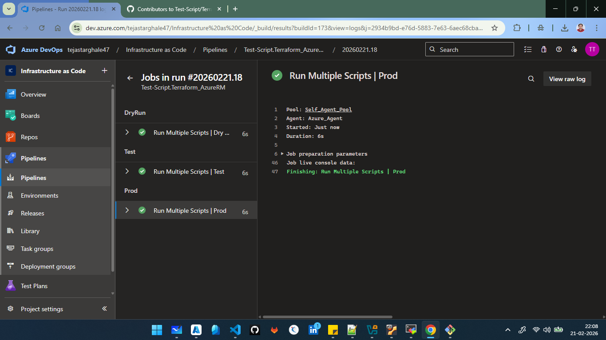

=======================================================================================
                            Ran the Pipeline with local | Group
=======================================================================================

trigger:
- main

pool:
  name: Self_Agent_Pool

variables:
- group: Dry Run
- group: Test Run
- name: my-local-var
  value: 'hello'
stages:
- stage: DryRun
  jobs:
  - job: DryScript
    displayName: 'Run Multiple Scripts | Dry Run'
    steps:
      - script: echo "Hello, World!"
        displayName: 'Run a one-line script | Dry Run'
      - script: |
          echo "This is a multi-line script."
          echo "You can run multiple commands here."
          echo "$(Key1)"
          echo "$(Key2)"
          echo "$(Key_Test1)"
          echo "$(Key_Test2)"
          echo "$(my-local-var)"
        displayName: 'Run a multi-line script | Dry Run'
      - script: |
          echo "This is a script with a custom display name."
        displayName: 'Run a multi-line script with a custom name | Dry Run'

- stage: Test
  dependsOn: DryRun
  jobs:
  - job: TestScripts
    displayName: 'Run Multiple Scripts | Test'
    steps:
      - script: echo "Hello, World!"
        displayName: 'Run a one-line script | Test'
      - script: |
          echo "This is a multi-line script."
          echo "You can run multiple commands here."
        displayName: 'Run a multi-line script | Test'
      - script: |
          echo "This is a script with a custom display name."
        displayName: 'Run a multi-line script with a custom name | Test'

- stage: Prod
  dependsOn: Test
  jobs:
  - job: ProdScripts
    displayName: 'Run Multiple Scripts | Prod'
    steps:
      - script: echo "Hello, World!"
        displayName: 'Run a one-line script | Prod'
      - script: |
          echo "This is a multi-line script."
          echo "You can run multiple commands here."
        displayName: 'Run a multi-line script | Prod'
      - script: |
          echo "This is a script with a custom display name."
        displayName: 'Run a multi-line script with a custom name | Prod'

=======================================================================================
                        Jobs in run #20260221.18
=======================================================================================

2026-02-21T16:36:26.9859747Z ##[section]Starting: Run Multiple Scripts | Prod
2026-02-21T16:36:27.2958135Z ##[section]Starting: Initialize job
2026-02-21T16:36:27.2961533Z Agent name: 'Azure_Agent'
2026-02-21T16:36:27.2962014Z Agent machine name: 'admin'
2026-02-21T16:36:27.2962239Z Current agent version: '4.266.2'
2026-02-21T16:36:27.4655068Z Agent running as: 'vboxuser'
2026-02-21T16:36:27.5170528Z Prepare build directory.
2026-02-21T16:36:27.6104062Z Set build variables.
2026-02-21T16:36:27.6142171Z Download all required tasks.
2026-02-21T16:36:27.7638465Z Checking job knob settings.
2026-02-21T16:36:27.7646166Z    Knob: DockerActionRetries = true Source: $(VSTSAGENT_DOCKER_ACTION_RETRIES) 
2026-02-21T16:36:27.7647881Z    Knob: UseGitLongPaths = true Source: $(USE_GIT_LONG_PATHS) 
2026-02-21T16:36:27.7650114Z    Knob: UseNode24withHandlerData = True Source: $(DistributedTask.Agent.UseNode24withHandlerData) 
2026-02-21T16:36:27.7652174Z    Knob: EnableIssueSourceValidation = true Source: $(ENABLE_ISSUE_SOURCE_VALIDATION) 
2026-02-21T16:36:27.7653329Z    Knob: AgentEnablePipelineArtifactLargeChunkSize = true Source: $(AGENT_ENABLE_PIPELINEARTIFACT_LARGE_CHUNK_SIZE) 
2026-02-21T16:36:27.7656103Z    Knob: ContinueAfterCancelProcessTreeKillAttempt = true Source: $(VSTSAGENT_CONTINUE_AFTER_CANCEL_PROCESSTREEKILL_ATTEMPT) 
2026-02-21T16:36:27.7656947Z    Knob: ProcessHandlerSecureArguments = false Source: $(AZP_75787_ENABLE_NEW_LOGIC) 
2026-02-21T16:36:27.7657508Z    Knob: ProcessHandlerSecureArguments = false Source: $(AZP_75787_ENABLE_NEW_LOGIC_LOG) 
2026-02-21T16:36:27.7658047Z    Knob: ProcessHandlerTelemetry = true Source: $(AZP_75787_ENABLE_COLLECT) 
2026-02-21T16:36:27.7658866Z    Knob: UseNewNodeHandlerTelemetry = True Source: $(DistributedTask.Agent.USENEWNODEHANDLERTELEMETRY) 
2026-02-21T16:36:27.7659640Z    Knob: ProcessHandlerEnableNewLogic = true Source: $(AZP_75787_ENABLE_NEW_PH_LOGIC) 
2026-02-21T16:36:27.7661475Z    Knob: EnableResourceMonitorDebugOutput = true Source: $(AZP_ENABLE_RESOURCE_MONITOR_DEBUG_OUTPUT) 
2026-02-21T16:36:27.7662120Z    Knob: EnableResourceUtilizationWarnings = true Source: $(AZP_ENABLE_RESOURCE_UTILIZATION_WARNINGS) 
2026-02-21T16:36:27.7662991Z    Knob: IgnoreVSTSTaskLib = true Source: $(AZP_AGENT_IGNORE_VSTSTASKLIB) 
2026-02-21T16:36:27.7663525Z    Knob: FailJobWhenAgentDies = true Source: $(FAIL_JOB_WHEN_AGENT_DIES) 
2026-02-21T16:36:27.7664227Z    Knob: CheckForTaskDeprecation = true Source: $(AZP_AGENT_CHECK_FOR_TASK_DEPRECATION) 
2026-02-21T16:36:27.7664995Z    Knob: CheckIfTaskNodeRunnerIsDeprecated246 = True Source: $(DistributedTask.Agent.CheckIfTaskNodeRunnerIsDeprecated246) 
2026-02-21T16:36:27.7666191Z    Knob: EnableTimeoutLogFlushing = True Source: $(DistributedTask.Agent.EnableTimeoutLogFlushing) 
2026-02-21T16:36:27.7667028Z    Knob: LogTaskNameInUserAgent = true Source: $(AZP_AGENT_LOG_TASKNAME_IN_USERAGENT) 
2026-02-21T16:36:27.7667597Z    Knob: UseFetchFilterInCheckoutTask = true Source: $(AGENT_USE_FETCH_FILTER_IN_CHECKOUT_TASK) 
2026-02-21T16:36:27.7668288Z    Knob: Rosetta2Warning = true Source: $(ROSETTA2_WARNING) 
2026-02-21T16:36:27.7668860Z    Knob: CheckPsModulesLocations = False Source: $(DistributedTask.Agent.CheckPsModulesLocations) 
2026-02-21T16:36:27.7670955Z    Knob: AddForceCredentialsToGitCheckoutEnhanced = True Source: $(DistributedTask.Agent.AddForceCredentialsToGitCheckoutEnhanced) 
2026-02-21T16:36:27.7672101Z    Knob: UseLatestTfExe = True Source: $(DistributedTask.Agent.UseLatestTfExe) 
2026-02-21T16:36:27.7672917Z    Knob: UseSparseCheckoutInCheckoutTask = true Source: $(AGENT_USE_SPARSE_CHECKOUT_IN_CHECKOUT_TASK) 
2026-02-21T16:36:27.7673701Z    Knob: AgentCDNConnectivityFailWarning = False Source: $(DistributedTask.Agent.AgentCDNConnectivityFailWarning) 
2026-02-21T16:36:27.7674308Z    Knob: UseEnhancedLogging = true Source: ${AZP_USE_ENHANCED_LOGGING} 
2026-02-21T16:36:27.7674890Z Finished checking job knob settings.
2026-02-21T16:36:27.8196900Z Start tracking orphan processes.
2026-02-21T16:36:27.8426332Z ##[section]Finishing: Initialize job
2026-02-21T16:36:27.8589345Z ##[section]Async Command Start: DetectDockerContainer
2026-02-21T16:36:27.8591088Z ##[section]Async Command End: DetectDockerContainer
2026-02-21T16:36:27.8593815Z ##[section]Async Command Start: DetectDockerContainer
2026-02-21T16:36:27.8594348Z ##[section]Async Command End: DetectDockerContainer
2026-02-21T16:36:27.8846981Z ##[section]Starting: Checkout Test-Script/Terraform_AzureRM@main to s
2026-02-21T16:36:27.8996617Z ==============================================================================
2026-02-21T16:36:27.8997843Z Task         : Get sources
2026-02-21T16:36:27.8998342Z Description  : Get sources from a repository. Supports Git, TfsVC, and SVN repositories.
2026-02-21T16:36:27.8998577Z Version      : 1.0.0
2026-02-21T16:36:27.8998922Z Author       : Microsoft
2026-02-21T16:36:27.8999771Z Help         : [More Information](https://go.microsoft.com/fwlink/?LinkId=798199)
2026-02-21T16:36:27.9000037Z ==============================================================================
2026-02-21T16:36:28.7374416Z Syncing repository: Test-Script/Terraform_AzureRM (GitHub)
2026-02-21T16:36:28.7536984Z ##[command]git version
2026-02-21T16:36:28.7764509Z git version 2.43.0
2026-02-21T16:36:28.7922175Z ##[command]git config --get remote.origin.url
2026-02-21T16:36:28.8213509Z ##[command]git clean -ffdx
2026-02-21T16:36:28.8348341Z ##[command]git reset --hard HEAD
2026-02-21T16:36:28.8449672Z HEAD is now at c043be7 Dry Run | With Local Varibles
2026-02-21T16:36:28.8505752Z ##[command]git sparse-checkout disable
2026-02-21T16:36:28.8638758Z ##[command]git config gc.auto 0
2026-02-21T16:36:28.8716791Z ##[command]git config core.longpaths true
2026-02-21T16:36:28.8781143Z ##[command]git config --get-all http.https://github.com/Test-Script/Terraform_AzureRM.extraheader
2026-02-21T16:36:28.8863873Z ##[command]git config --get-all http.extraheader
2026-02-21T16:36:28.8940772Z ##[command]git config --get-regexp .*extraheader
2026-02-21T16:36:28.9044507Z ##[command]git config --get-all http.proxy
2026-02-21T16:36:28.9151550Z ##[command]git config http.version HTTP/1.1
2026-02-21T16:36:28.9244094Z ##[command]git config --get-all remote.origin.promisor
2026-02-21T16:36:28.9333636Z ##[command]git config --get-all remote.origin.partialclonefilter
2026-02-21T16:36:28.9444520Z ##[command]git --config-env=http.extraheader=env_var_http.extraheader fetch --force --tags --prune --prune-tags --progress --no-recurse-submodules origin --depth=1  +c043be7d6a29d51135eefb72956b136bc97f96f5:refs/remotes/origin/c043be7d6a29d51135eefb72956b136bc97f96f5
2026-02-21T16:36:29.9545906Z remote: Total 0 (delta 0), reused 0 (delta 0), pack-reused 0 (from 0)        
2026-02-21T16:36:30.1254009Z ##[command]git --config-env=http.extraheader=env_var_http.extraheader fetch --force --tags --prune --prune-tags --progress --no-recurse-submodules origin --depth=1  +c043be7d6a29d51135eefb72956b136bc97f96f5
2026-02-21T16:36:30.8686394Z remote: Total 0 (delta 0), reused 0 (delta 0), pack-reused 0 (from 0)        
2026-02-21T16:36:30.8873067Z From https://github.com/Test-Script/Terraform_AzureRM
2026-02-21T16:36:30.8875118Z  * branch            c043be7d6a29d51135eefb72956b136bc97f96f5 -> FETCH_HEAD
2026-02-21T16:36:31.0148805Z ##[command]git checkout --progress --force refs/remotes/origin/c043be7d6a29d51135eefb72956b136bc97f96f5
2026-02-21T16:36:31.0201521Z HEAD is now at c043be7 Dry Run | With Local Varibles
2026-02-21T16:36:31.0332117Z ##[section]Finishing: Checkout Test-Script/Terraform_AzureRM@main to s
2026-02-21T16:36:31.0508493Z ##[section]Starting: Run a one-line script | Prod
2026-02-21T16:36:31.0536074Z ==============================================================================
2026-02-21T16:36:31.0536692Z Task         : Command line
2026-02-21T16:36:31.0537031Z Description  : Run a command line script using Bash on Linux and macOS and cmd.exe on Windows
2026-02-21T16:36:31.0537525Z Version      : 2.268.0
2026-02-21T16:36:31.0537842Z Author       : Microsoft Corporation
2026-02-21T16:36:31.0538161Z Help         : https://docs.microsoft.com/azure/devops/pipelines/tasks/utility/command-line
2026-02-21T16:36:31.0539028Z ==============================================================================
2026-02-21T16:36:31.6996020Z Generating script.
2026-02-21T16:36:31.7026201Z Script contents:
2026-02-21T16:36:31.7031732Z echo "Hello, World!"
2026-02-21T16:36:31.7035076Z ========================== Starting Command Output ===========================
2026-02-21T16:36:31.7076479Z [command]/usr/bin/bash --noprofile --norc /home/vboxuser/Agent/_work/_temp/7493cd25-7e63-4885-bb45-921d783552cd.sh
2026-02-21T16:36:31.7228821Z Hello, World!
2026-02-21T16:36:31.7275243Z 
2026-02-21T16:36:31.7492787Z ##[section]Finishing: Run a one-line script | Prod
2026-02-21T16:36:31.7651991Z ##[section]Starting: Run a multi-line script | Prod
2026-02-21T16:36:31.7675797Z ==============================================================================
2026-02-21T16:36:31.7676315Z Task         : Command line
2026-02-21T16:36:31.7676668Z Description  : Run a command line script using Bash on Linux and macOS and cmd.exe on Windows
2026-02-21T16:36:31.7677199Z Version      : 2.268.0
2026-02-21T16:36:31.7677540Z Author       : Microsoft Corporation
2026-02-21T16:36:31.7677898Z Help         : https://docs.microsoft.com/azure/devops/pipelines/tasks/utility/command-line
2026-02-21T16:36:31.7678387Z ==============================================================================
2026-02-21T16:36:32.4149409Z Generating script.
2026-02-21T16:36:32.4169199Z ========================== Starting Command Output ===========================
2026-02-21T16:36:32.4217763Z [command]/usr/bin/bash --noprofile --norc /home/vboxuser/Agent/_work/_temp/f1a7734b-5f07-4348-8889-1651536d16a8.sh
2026-02-21T16:36:32.4378847Z This is a multi-line script.
2026-02-21T16:36:32.4387897Z You can run multiple commands here.
2026-02-21T16:36:32.4417900Z 
2026-02-21T16:36:32.4603920Z ##[section]Finishing: Run a multi-line script | Prod
2026-02-21T16:36:32.4806829Z ##[section]Starting: Run a multi-line script with a custom name | Prod
2026-02-21T16:36:32.4848058Z ==============================================================================
2026-02-21T16:36:32.4848831Z Task         : Command line
2026-02-21T16:36:32.4849372Z Description  : Run a command line script using Bash on Linux and macOS and cmd.exe on Windows
2026-02-21T16:36:32.4850110Z Version      : 2.268.0
2026-02-21T16:36:32.4850645Z Author       : Microsoft Corporation
2026-02-21T16:36:32.4851257Z Help         : https://docs.microsoft.com/azure/devops/pipelines/tasks/utility/command-line
2026-02-21T16:36:32.4851957Z ==============================================================================
2026-02-21T16:36:33.1137200Z Generating script.
2026-02-21T16:36:33.1144596Z Script contents:
2026-02-21T16:36:33.1144939Z echo "This is a script with a custom display name."
2026-02-21T16:36:33.1145324Z ========================== Starting Command Output ===========================
2026-02-21T16:36:33.1185535Z [command]/usr/bin/bash --noprofile --norc /home/vboxuser/Agent/_work/_temp/451fb17a-7ad1-4240-9aa1-a520981f6e05.sh
2026-02-21T16:36:33.1354358Z This is a script with a custom display name.
2026-02-21T16:36:33.1426263Z 
2026-02-21T16:36:33.1588642Z ##[section]Finishing: Run a multi-line script with a custom name | Prod
2026-02-21T16:36:33.1658232Z ##[section]Starting: Checkout Test-Script/Terraform_AzureRM@main to s
2026-02-21T16:36:33.1669613Z ==============================================================================
2026-02-21T16:36:33.1669840Z Task         : Get sources
2026-02-21T16:36:33.1669952Z Description  : Get sources from a repository. Supports Git, TfsVC, and SVN repositories.
2026-02-21T16:36:33.1670114Z Version      : 1.0.0
2026-02-21T16:36:33.1670224Z Author       : Microsoft
2026-02-21T16:36:33.1670339Z Help         : [More Information](https://go.microsoft.com/fwlink/?LinkId=798199)
2026-02-21T16:36:33.1670475Z ==============================================================================
2026-02-21T16:36:33.7776356Z Cleaning any cached credential from repository: Test-Script/Terraform_AzureRM (GitHub)
2026-02-21T16:36:33.8100754Z ##[section]Finishing: Checkout Test-Script/Terraform_AzureRM@main to s
2026-02-21T16:36:33.8151336Z ##[section]Starting: Finalize Job
2026-02-21T16:36:33.8185660Z Cleaning up task key
2026-02-21T16:36:33.8190668Z Start cleaning up orphan processes.
2026-02-21T16:36:33.8691543Z ##[section]Finishing: Finalize Job
2026-02-21T16:36:33.8774143Z ##[section]Finishing: Run Multiple Scripts | Prod

=======================================================================================