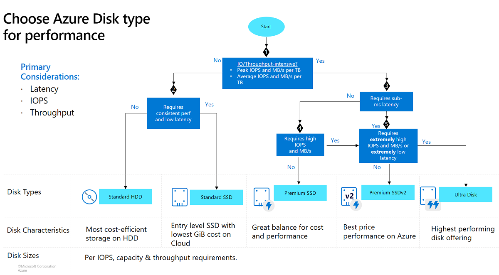

==================================
Azure Disk Selection 
==================================

Objectives :

1. High Performance System.
2. Low Latency
3. High Availability

Demands with respect to IOPS, and Throughput.

1. Number of Concurrent Users
2. Types Of Operation (Read/Write)
3. Size of data per Operation

(IOPS,Avg block size,Read/write ratio,Latency sensitivity)

Example :

Workload Generates the demands:

 1000 users making the request in one second, each user's request thorughs 20DB Queries, and Each Query takes the 2 pages of data (4KB Page Size * 2 Pages).

    IOPS: 1000 users * 20 queries * 2 pages = 40,000 IOPS.

    Throghput: 40,000 IOPS x 8 KB (I/O Size) = 312.5 MB/s

Throghput = IOPS x I/O Size

Checklist for Selection:

1. Calculate Peak IOPS: (Users × Requests × Pages).
2. Calculate Peak Throughput: (IOPS × Page Size).
3. Check VM Limits: Ensure the VM supports the total IOPS/Throughput of all attached disks.
4. Select Disk Tier: Choose between Premium v1, v2, or Ultra based on the calculated numbers.

=============================

Azure Disk having following things for the disk selections

Storage Type : Premium SSD, Premiusm SSD V2, Standard SSD, Standard HHD.

Disk Tier : P-Series (Premium-SSDs), E-Series (Standard-SSD), U-Series (Ultra), S-Series (HHD).

Provisioned / Burstable Limits for IOPS, Throughputs.

=============================