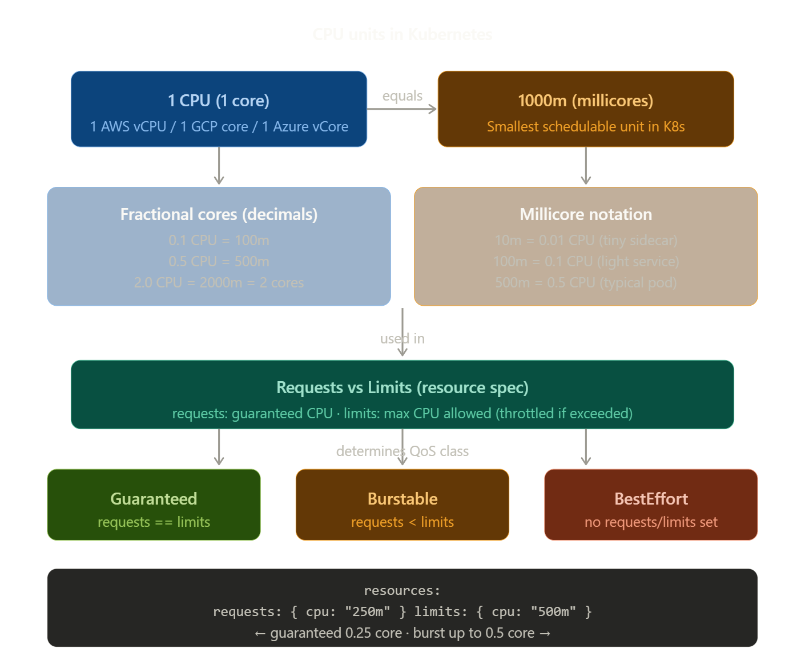

==========================================================================================================
                                    CPU measurement units in Kubernetes
==========================================================================================================

In standard computing, CPU time is measured in cycles, GHz, or percentages. Kubernetes introduces its own unit system to be cloud-agnostic and precise across any hardware.

Kubernetes expresses CPU in two equivalent ways — you can mix them freely within a cluster:

- 0.5,1, and 2 : 1 means one full logical CPU
- 1000m - millicore notation. m --> milli, so 1000m = 1 CPU, 500m = 0.5 CPU, 10m = 0.01 CPU.

# Requests vs Limits :

Every container spec has two separate CPU fields:

- requests : the CPU the scheduler guarantees. The pod is only placed on a node with at least this much free capacity.

- limits : 